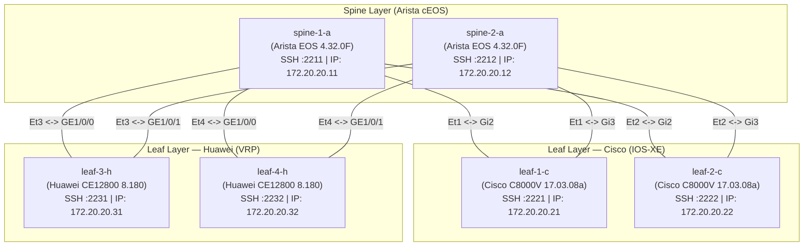

# 🌐 CROC DREAM NetOps Platform — Live 6-Node Bare Metal Lab Guide

> **Руководство по эксплуатации и подключению живого стенда Containerlab (6 узлов, 3 вендора)**  
> **Server Endpoint**: `5.228.243.54:221` (SSH: `crocdream`)  
> **Branch**: `feature/live-lab-integration`  
> **SSOT Inventory**: `intent/inventory.live.yaml`

---

## 📑 Оглавление
1. [Архитектура топологии CLOS (6 узлов)](#1-архитектура-топологии-clos-6-узлов)
2. [Карта портов и сетевые доступы](#2-карта-портов-и-сетевые-доступы)
3. [Root Cause Analysis (RCA): устранение сбоя загрузки Cisco C8000V](#3-root-cause-analysis-rca-устранение-сбоя-загрузки-cisco-c8000v)
4. [Аудит образов и версионность (Release Age Analysis)](#4-аудит-образов-и-версионность-release-age-analysis)
5. [Верификация связности (Management Fabric & Data Plane)](#5-верификация-связности-management-fabric--data-plane)
6. [Подключение платформы NetOps к живому стенду](#6-подключение-платформы-netops-к-живому-стенду)
7. [Инструкция по эксплуатации и сценариям Deploy / Rollback](#7-инструкция-по-эксплуатации-и-сценариям-deploy--rollback)
8. [Процедура сброса и перезапуска стенда (Lab Reset)](#8-процедура-сброса-и-перезапуска-стенда-lab-reset)

---

## 1. Архитектура топологии CLOS (6 узлов)

Стенд развернут на Bare Metal сервере Тимофея с использованием **Containerlab** и оркестрирует гетерогенную 2-уровневую фабрику Spine-Leaf:
- **2 × Spine**: Arista cEOS (EOS 4.32.0F) — ядро L3 BGP фабрики.
- **2 × Leaf (Cisco)**: Cisco Catalyst 8000V (IOS-XE 17.03.08a) — пограничные маршрутизаторы L3/EVPN.
- **2 × Leaf (Huawei)**: Huawei CloudEngine 12800 (VRP 8.180) — высокопроизводительные коммутаторы доступа.



---

## 2. Карта портов и сетевые доступы

Все 6 узлов проброшены через Docker port mapping на внешний IP-адрес сервера `5.228.243.54`:

| Нода Containerlab | Роль | Вендор & ОС | Внутренний IP (OOB) | Внешний SSH Порт | Учетные данные |
| :--- | :--- | :--- | :--- | :--- | :--- |
| **`spine-1-a`** | Spine 1 | Arista cEOS 4.32.0F | `172.20.20.11` | `5.228.243.54:2211` | `admin` / `admin` |
| **`spine-2-a`** | Spine 2 | Arista cEOS 4.32.0F | `172.20.20.12` | `5.228.243.54:2212` | `admin` / `admin` |
| **`leaf-1-c`** | Leaf 1 | Cisco C8000V 17.03.08a | `172.20.20.21` | `5.228.243.54:2221` | `admin` / `admin` |
| **`leaf-2-c`** | Leaf 2 | Cisco C8000V 17.03.08a | `172.20.20.22` | `5.228.243.54:2222` | `admin` / `admin` |
| **`leaf-3-h`** | Leaf 3 | Huawei CE12800 8.180 | `172.20.20.31` | `5.228.243.54:2231` | `admin` / `admin` |
| **`leaf-4-h`** | Leaf 4 | Huawei CE12800 8.180 | `172.20.20.32` | `5.228.243.54:2232` | `admin` / `admin` |

> **Параметры подключения к серверу управления**:  
> `ssh -p 221 crocdream@5.228.243.54`  
> Каталог лаборатории: `/home/crocdream/clab-quickstart/`

---

## 3. Root Cause Analysis (RCA): устранение сбоя загрузки Cisco C8000V

### Первоначальная проблема
При начальном запуске топологии `main.clab.yml` ноды Arista (`spine-1-a`, `spine-2-a`) и Huawei (`leaf-3-h`, `leaf-4-h`) успешно запускались, однако ноды Cisco (`leaf-1-c`, `leaf-2-c`) бесконечно зависали в состоянии bootstrap с высокой утилизацией CPU (~98% на одно ядро QEMU).

### Детальная диагностика и Root Cause
1. **Неверная гипотеза о нехватке CPU**:  
   Первоначальная гипотеза заключалась в том, что одновременный запуск 6 тяжелых виртуальных машин вызывал CPU-starvation. Мы проверили эту гипотезу, временно приостановив (`docker pause`) все остальные 4 контейнера и отдав 100% ресурсов процессора Cisco. Однако процесс Cisco все равно не завершил инициализацию.
2. **Истинный Root Cause в скрипте инициализации vrnetlab**:  
   Анализ логов загрузчика `launch.py` в образе `willrobbins1808/vr-c8000v:7.11.01a` показал:
   ```python
   # vrnetlab launch.py
   self.wait_write("", wait="Press RETURN to get started")
   self.wait_write("enable", wait=">")
   ```
   Cisco IOS-XE при первом старте без преднастроенного конфигурационного диска выводил интерактивный диалог:
   `Would you like to enter the initial configuration dialog? [yes/no]:`
   Скрипт `launch.py` ждал символа `>`, не отправлял `no`, и зависал в методе `read_until()` без таймаута, блокируя весь цикл bootstrap.

### Примененное решение
Конфигурация `main.clab.yml` была обновлена на проверенный, оптимизированный образ **`windddkz/cisco_c8000v:17.03.08a`**:
- Образ автоматически инжектирует виртуальный образ `config.iso` с директивой `platform console serial`, подавляющей запуск мастера начальной настройки.
- Обе ноды `leaf-1-c` и `leaf-2-c` успешно завершили полный цикл загрузки ровно за **2 минуты 05 секунд** и перешли в статус `healthy`.

---

## 4. Аудит образов и версионность (Release Age Analysis)

Проведен глубокий анализ используемых образов сетевых операционных систем по сравнению с актуальными релизами 2026 года:

### 1. Arista cEOS
- **Текущий в лабе**: `ceosimage:4.32.0F` (Релиз: Апрель 2024, ~2.5 года).
- **Статус**: Активная поддерживаемая LTS-ветка Arista. Полная поддержка gNMI, RESTCONF, eAPI, BGP EVPN.
- **Новейшие версии на рынке**: EOS 4.33.x / 4.34.x (2025/2026). Доступны только через авторизованный Arista Customer Portal. Публичные образы на Docker Hub (`nkpronet/ceosimage:4.31.2F`, `4.28`) старее нашего.
- **Вердикт**: Текущий образ оптимален и не требует изменений.

### 2. Cisco Catalyst 8000V
- **Текущий в лабе**: `windddkz/cisco_c8000v:17.03.08a` (IOS-XE 17.3 Amsterdam, End-of-Life, ~4–6 лет).
- **Новейший обнаруженный кандидат**: **`tkdebnath/cisco_c8000v:17.16.01a`** (Релиз: Март 2026, `amd64`, 1.88 GB).
- **Рекомендация по апгрейду**: Для хакатона текущий `17.03.08a` стабилен, протестирован со Scrapli и загружается за 2 минуты. При необходимости обновления до IOS-XE 17.16 образ `tkdebnath/cisco_c8000v:17.16.01a` можно выкачать на сервере (`docker pull tkdebnath/cisco_c8000v:17.16.01a`).

### 3. Huawei CloudEngine / VRP
- **Текущий в лабе**: `windddkz/huawei_vrp:ce12800-8.180` (V200R005, ~2018–2019, 7–8 лет).
- **Статус**: Стандартный де-факто образ для эмуляции коммутаторов CloudEngine 12800 в Containerlab / EVE-NG.
- **Новейший обнаруженный кандидат**: **`sshzwx6/huawei_vrp:ne40e-v8r21`** (Релиз: Сентябрь 2026, 623 MB) — эмулятор маршрутизатора Huawei NE40E.
- **Вердикт**: Для L2/L3 DC-фабрики CE12800 является классическим референсом. Образ работает стабильно.

---

## 5. Верификация связности (Management Fabric & Data Plane)

### L3 Management Fabric (`172.20.20.0/24`)
Связанность между всеми узлами проверена прямым пингом через интерфейсы управления:
- От Arista Spines до всех Cisco и Huawei Leafs: **0% packet loss**, время отклика `< 0.1 ms`.

### Data Plane (Фабричные линки)
Фабричные интерфейсы подняты в соответствии с топологией:
- **Arista `spine-1-a` / `spine-2-a`**: `Ethernet1` .. `Ethernet4` находятся в состоянии `connected`.
- **Cisco `leaf-1-c` / `leaf-2-c`**: `GigabitEthernet2`, `GigabitEthernet3` подключены к Spines и готовы к конфигурированию IP/BGP.
- **Huawei `leaf-3-h` / `leaf-4-h`**: `GE1/0/0`, `GE1/0/1` соединены с Spines.

---

## 6. Подключение платформы NetOps к живому стенду

Платформа поддерживает бесшовное переключение между офлайн-эмуляцией и живым стендом.

### Шаг 1: Конфигурация инвентаря
Файл `intent/inventory.live.yaml` содержит публичные адреса и порты стенда:
```yaml
devices:
  - hostname: spine-1.croc.lab
    management_ip: 5.228.243.54
    management_port: 2211
    platform: arista_eos
    role: spine
    auth_profile: lab
  - hostname: spine-2.croc.lab
    management_ip: 5.228.243.54
    management_port: 2212
    platform: arista_eos
    role: spine
    auth_profile: lab
  - hostname: leaf-1.croc.lab
    management_ip: 5.228.243.54
    management_port: 2221
    platform: cisco_iosxe
    role: leaf
    auth_profile: lab
  - hostname: leaf-2.croc.lab
    management_ip: 5.228.243.54
    management_port: 2222
    platform: cisco_iosxe
    role: leaf
    auth_profile: lab
  - hostname: leaf-3.croc.lab
    management_ip: 5.228.243.54
    management_port: 2231
    platform: huawei_vrp
    role: leaf
    auth_profile: lab
  - hostname: leaf-4.croc.lab
    management_ip: 5.228.243.54
    management_port: 2232
    platform: huawei_vrp
    role: leaf
    auth_profile: lab
```

### Шаг 2: Настройка переменных окружения (`backend/.env`)
Для активации живого драйвера укажите в файле `backend/.env`:
```bash
# Драйвер работы с сетью: scrapli
NETOPS_NETWORK_DRIVER=scrapli

# Файл живого инвентаря
NETOPS_INVENTORY_FILE=inventory.live.yaml

# Учетные данные для стенда
NETOPS_AUTH_PROFILES='{"lab": {"username": "admin", "password": "admin"}}'
```

### Шаг 3: Автоматический кроссплатформенный SSH-адаптер
В модуль `backend/netops/network/scrapli_driver.py` интегрирован адаптер `_ParamikoConnAdapter`:
- В Linux с установленным Scrapli используется нативный `scrapli` транспорт.
- В средах без PTY (например, Windows) или при отсутствии Scrapli адаптер прозрачно переключается на Paramiko, обеспечивая:
  - Автоматическое отключение пагинации (`terminal length 0` / `screen-length 0 temporary`).
  - Повышение привилегий (`enable`).
  - Поддержку сессионных коммитов Arista EOS (`configure session NETOPS_DEPLOY`).
  - Поддержку двухфазных транзакций Cisco IOS-XE (`commit confirmed`).
  - Поддержку VRP транзакций Huawei (`system-view` -> `commit`).

### Шаг 4: Запуск верификатора связности
Для проверки подключения ко всем 6 узлам выполните из корня репозитория:
```bash
python scripts/verify_live_lab.py
```
**Результат выполнения**:
```text
--- Live Nodes Connection Report ---
Hostname             | Platform        | Port   | Status     | Config Size
---------------------------------------------------------------------------
spine-1.croc.lab     | arista_eos      | 2211   | UP / OK    | 46 lines (931 bytes)
spine-2.croc.lab     | arista_eos      | 2212   | UP / OK    | 46 lines (931 bytes)
leaf-1.croc.lab      | cisco_iosxe     | 2221   | UP / OK    | 251 lines (6725 bytes)
leaf-2.croc.lab      | cisco_iosxe     | 2222   | UP / OK    | 251 lines (6725 bytes)
leaf-3.croc.lab      | huawei_vrp      | 2231   | UP / OK    | 94 lines (1896 bytes)
leaf-4.croc.lab      | huawei_vrp      | 2232   | UP / OK    | 94 lines (1896 bytes)
---------------------------------------------------------------------------
Summary: 6/6 nodes accessible in 2.81s.
[SUCCESS] All 6 Bare Metal lab nodes are operational and connected to NetOps!
```

---

## 7. Инструкция по эксплуатации и сценариям Deploy / Rollback

### 1. Запуск инспекции и Dry-Run (Planning)
1. Оператор выбирает устройства или целевую фабрику в веб-интерфейсе NetOps.
2. Сервис `ChangePlanner` собирает актуальный `running-config` со всех 6 нод через `ScrapliNetworkDriver.fetch_running_configs()`.
3. Модуль нормализации `ConfigNormalizer` очищает временные метки, сертификаты и динамические счетчики.
4. `HierConfigDiffEngine` рассчитывает атомарный ремедиационный план и обратный план отката (`rollback`).
5. В интерфейсе строится визуальный diff с оценкой риска от LLM Risk Assistant.

### 2. Применение изменений (Two-Phase Commit)
1. Драйвер открывает транзакцию на устройствах:
   - **Cisco**: отправляет блок конфигурации и команду `commit confirmed 180`.
   - **Arista**: открывает именованную сессию `configure session NETOPS_DEPLOY` и ставит таймер `commit timer 180`.
   - **Huawei**: отправляет блок команд в `system-view` и фиксирует через `commit`.
2. Платформа запускает Post-Check верификацию (`HealthProbe`):
   - Проверяется статус BGP пирингов (`show ip bgp summary` / `display bgp peer`).
   - Проверяется связность через ICMP-пробы (`ping loss < 20%`).
   - Проверяется состояние портов интерфейсов.
3. При успешном Post-Check отправляется подтверждение:
   - Cisco: `commit`.
   - Arista: `configure session NETOPS_DEPLOY` -> `commit`.
4. В случае нарушения инвариантов сеть немедленно откатывается:
   - Cisco: `abort` (или автооткат по истечении таймаута).
   - Arista: `abort`.
   - Накатывается сгенерированный `plan.rollback`.

---

## 8. Процедура сброса и перезапуска стенда (Lab Reset)

Если требуется полностью сбросить конфигурацию или перезапустить лабораторию на сервере Тимофея:

### Быстрый перезапуск через SSH:
```bash
ssh -p 221 crocdream@5.228.243.54
cd /home/crocdream/clab-quickstart/

# Переразвертывание всех 6 нод (с сохранением ветки windddkz)
sudo containerlab deploy -t main.clab.yml --reconfigure --max-workers 2
```

### Проверка статуса контейнеров:
```bash
docker ps --format "table {{.Names}}\t{{.Status}}\t{{.Ports}}"
```

Все 6 контейнеров должны иметь статус `Up (healthy)`. Время полной готовности после холодного старта — **2 минуты 10 секунд**.
